# Ultra Modular Landscape Technical Guide

Thank you for purchasing Ultra Modular Landscape (UML)!

This document is intended as a comprehensive technical guide, giving all the necessary practical descriptions of every feature that you might need while using the tool.

Should you have any questions while using the tool, it is advised to try to use the search functionality in this document first.

**PRO TIP**: You can upload this document to ChatGPT and ask questions from it, it will know most of the technical answers.

**IMPORTANT:** This documentation is maintained to be up-to-date with **Unreal Engine 5.6**. There might be slight differences if you are using a different version.

**Ultra Modular Landscape System**

The Ultra Modular Landscape System has 3 main components

- Modular Layered Landscape Material
- Blueprint Prefab mountains
- EasyPCG

## High Level Overview

**Ultra Modular Landscape Material**

UML uses Unreal’s Material Layer system. You might view this as having multiple material instances embedded within a single main material instance.

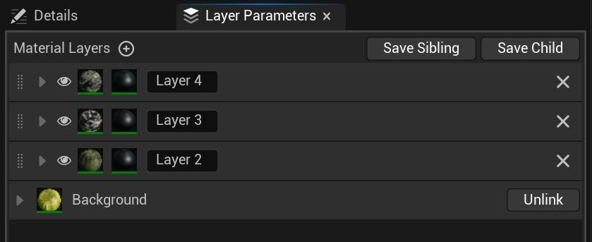

The material uses 3 main components:

- Master Material
- Master Material Layer Function
- Master Layer Blend Function

**Ultra Modular Landscape Prefabs**

These Blueprint Prefabs produce complete mountains in a matter of seconds. They can be scaled and combined with each other, while also providing a non-destructive workflow. The LandscapePatch plugin (previously known as Landmass) is required for them to work.

The erosion maps are regular textures that are written into the Landscape Paint Layers. The Prefab system can work with any type of erosion and height maps, you can even create your own in software like World Machine. It can also work with any kind of materials, but keep in mind that if you want to utilize the erosion maps written into Paint Layers, then your custom material needs to use the same Landscape Layer naming convention (Layer_1, Layer_2, … etc.).

**EasyPCG**

EaysPCG is an easy to use, fully customizable and versatile Blueprint, with a robust Procedural Content Generation (PCG) graph under its hood. You are free to use it with your own meshes and with your own landscape material, just keep in mind that to use the Layer Based Spawning, your custom material needs to use the same Landscape Layer naming convention (Layer_1, Layer_2, … etc.).

**Features dependent on each other.**

UML Material

- Without UML Brush BP the Gradient coloring works in a limited format, the user needs to supply a B&W gradient map by hand.

UML Prefab Blueprint

- Without the UML Material, the gradient mapping won’t work
- Without the UML Material, the automatic weight painting and layering won’t work
- Without the UML Material, you CAN still use this tool to sculpt Landscape mountains

**Plugin requirements**

UML Prefab Blueprint - Landscape Patch plugin

EasyPCG - Procedural Content Generation Framework plugin

## 1 - UML Material

**Master Material**

The master material is where we read the landscape layer weight data and where the Material Layers are cooked together. This is the place to read or modify the final outlook of our material. This means this is where we read/write the RVT (optionally if it is used). Additionally, do final effects that need bypassing the RVT (global overlay, view dependent effects like the fuzzy shading).

**Master Material Layer Function**

The Master Material Layer is the heart of the actual material, this is where all the usual features are, like texture samplers (base color, roughness, etc.) tiling UVs and every other visual feature. One of the huge advantages of UML compared to traditional landscape materials is that it has a single master function, which is used with every landscape layer as an instance. This means even if you end up using 12 different landscape layers and decide to modify the master material, you need to do it only once in a single location!

It goes into the Layer Asset slot of the Material Layer. The settings can be saved as a separate Instance that can be used for other Material Layers.

**Master Layer Blend Function**

This controls how the different layers are blended together, for example using height map based mixing. It goes into the Blend Asset slot of the Material Layer and can be saved as an instance, if you wish to reuse the settings with other Material Layers.

**Getting started**

### Material Creation

For a fresh start, create a new instance of the Master Material (M_UML_Master).

Unlike traditional material instances, we have only the global effects in the Details panel. Much of the actual work happens on the Layer Parameters tab. You can access it from Window > Layer Parameters.

Switching over to this tab, you will likely find a single layer called „Background”. This is the base layer, unfortunately its name is hard-coded by Epic. Hit the plus sign next to the Material Layers (marked by the arrow) to create a new layer.

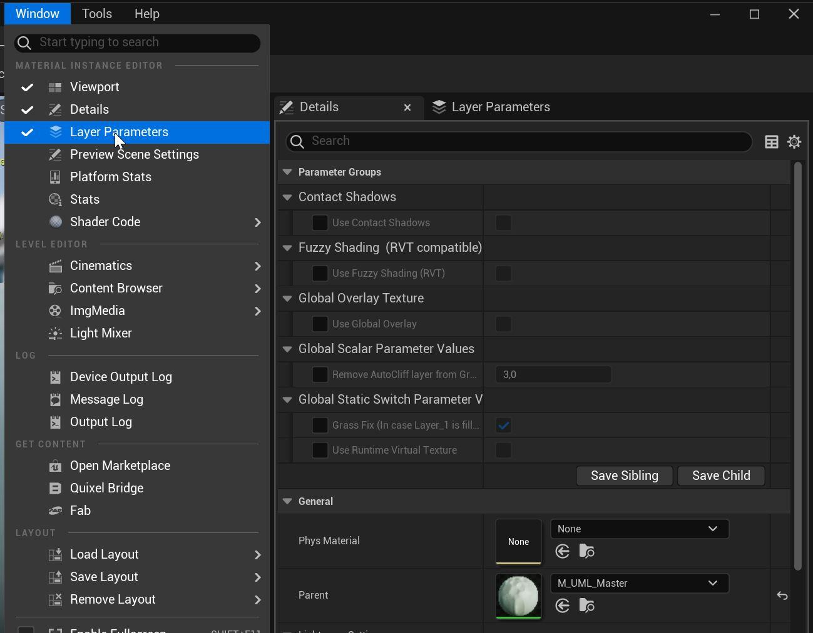

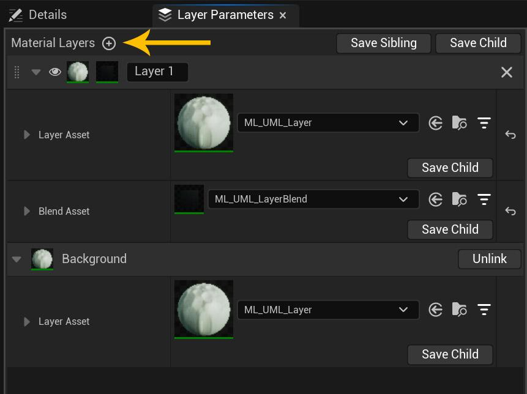

This new material layer will be empty by default and you need to select a Layer Asset, which will be UML’s Master Material Layer Function. You can also use a copy of an already existing layer by hitting the Save Child button (under the Layer Asset slot) and use the generated Layer instance instead of the Master Layer.

You will also need to select a Blend Asset, which will be UML’s Master Layer Blend Function or an instance of it.

### Applying the material to the Landscape

After plugging your new material instance into the Landscape’s material slot, head over to the Landscape Mode’s paint tab. Here you will see all the existing layers, which are dictated by the existing Landscape Layer Samples in the master material. It is a limitation coming from Epic, that we are not allowed to create these layer samples in a material instance, which means you need to set this in the master material. You can add new or delete existing layer samples at a later time as well.

Next we will need Layer Info files attached to each used layer, click the plus button in the Landscape Paint tab. It is advised to use Non Weight-blended option, this produces the cleanest result. You can also use Weight-blended but this can cause occasional haloing. It is also possible to use the latter for quick prototyping, then convert the Layer info files to Non Weight-blended later and clean up any artifacts in the end.

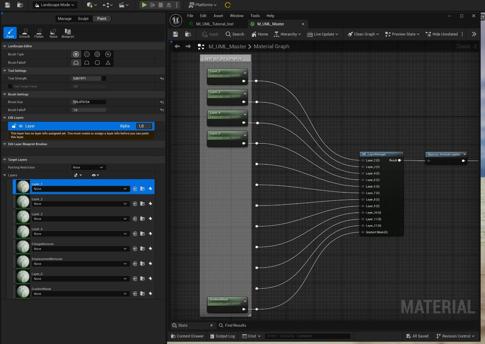

The next crucial step is enabling the blending in the material instance for all the layers that are used. Head to the Layer Parameters tab, open the Blend asset section and at the Layer Switch section select the appropriate. Since we have the mandatory „Background” layer, this is acting as Layer_1.

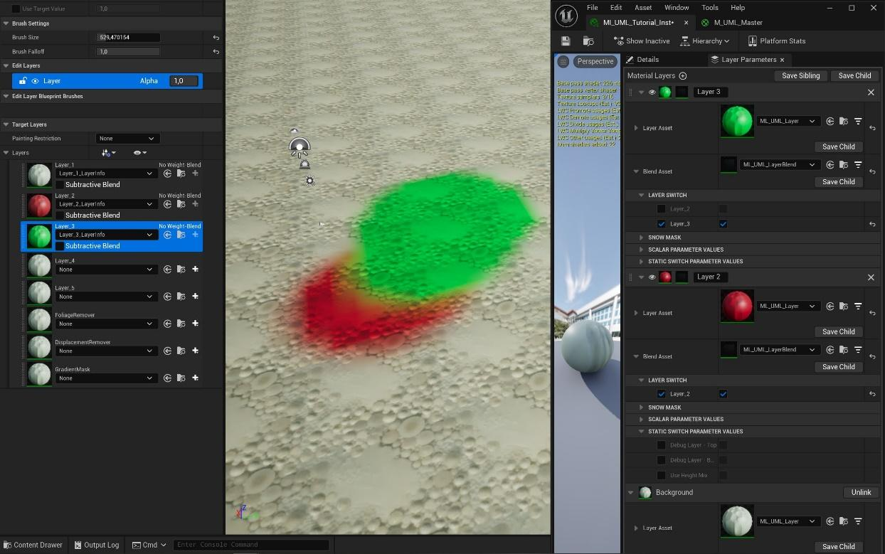

### Layer naming & ordering

As you can see the layers exist in multiple lists in multiple locations. You can freely reorganize the Landscape Paint tab, this is not affecting the actual drawing order. You are also free to rename the layers in the Layer Parameters tab as you wish, these are there for you to identify the layers more easily and have no functionality.

The actual render order depends on the order in the Layer Parameter tab in the material instance. Each layer has the dotted icon (next to the eye icon), you can drag the layer by clicking and holding this.

IMPORTANT: due to an editor bug, if the layer asset is the same for the two layers switching place, for example both uses the default ML_UML_Layer asset, then the reordering breaks. (It will exchange the names and some parameters but not all.) Currently a work-around is to make sure that each of the impacted layers use a unique Layer Asset. You can click the Save Child button, save the layer as a Layer Instance, then load this new asset into the Layer Asset slot.

IMPORTANT: make sure to remove the material instance from the landscape, then reapply it to have the reordering take effect.

The Blend Asset links the Layer to a specific Landscape Paint layer (Layer_2, Layer_3, … etc.). These are NOT affecting the drawing order, but it’s advised to keep them in sync to avoid confusion.

### Render features & Usage of a layer

In this section we will walk through all the features a layer has. To access these, open the Layer Asset drop down menu.

#### 00 – TILING

You will find every relevant feature that controls the texture scale and the UVs, including different projection methods and solutions to prevent texture repetition.

**Texture Repetition Related Features**

*Use Distant Textures*

This enables a secondary texture sampler that uses the same texture set as the primary. This texture set is visible after a set distance and uses a bigger tiling scale, acting basically as an LOD. The primary texture set is referred to as “Close”, the bigger scale LOD is “Distant”. The following parameters modify how the Distant (LOD) texture set behaves:

- *Scale Offset* – The scale multiplier compared to the base scale.
- *Fade in distance* - The distance where the secondary texture appears.
- *Fade in dist (RVT version)* – The same as above, but compatible with RVT
- *Transition contrast* – The sharpness of the transition phase between the two sets.

*Texture Variation Close + Texture Variation Distant*

This enables random noise based UV rotation, sometimes called texture bombing. You can separately enable/disable for the Close and the Distant LOD.

- *Texture Variation Close* – Enables this feature to the Close texture.
- *Texture Variation Distant* – Enables this feature to the Distant LOD.
- *Pattern Levels* – The number of different noise levels.
- *Pattern Scale* – The scale of the noise.
- *Random Texture Scale Range* – How much variation should be in the scale.
- *Random Rotation and Scale* – If disabled, the UV is only moved randomly left-right.

*Height Mixing distance fading (Close + Distant)*

If Height Mixing is enabled in the Layer Blend asset, then you can decide if you want to use only the Close or the Distant texture’s height map. This way if the camera gets closer or further, the mask won’t change, always looks identical. Otherwise you will see the blending „change” as the camera distance reaches the transition point between the Close and Distant texture LOD.

- *ON: only Close / OFF: only Distant* – If the above switch is off, then you can use this parameter to decide which texture set’s height map you want to use for the blending.

**UV Projection Methods**

*ON: WorldCoord UV / OFF: Landscape UV*

You can use simple WorldCoord UV projection (top down, world aligned) or the actual Landscape UVs using this switch.

*Use Triplanar/Biplanar Projection*

For high angle slopes you might want to use a Triplanar or Biplanar projection. This allows to avoid stretched textures on steep angled parts. The Biplanar uses only left-right and front-back projection. The Triplanar also has top-down projection.

- *ON: Triplanar OFF: Biplanar* – Switch between the two modes for optimization, Biplanar is cheaper.

#### 01 – BASE COLOR

The usual Base color tweak options.

#### 02 – BASE COLOR ADVANCED

*Use Gradient Coloring*

Gradient coloring uses a b&w gradient map and a color curve asset to colorize the surface. The gradient map is stored in a Landscape Layer’s weight map, which means it needs a dedicated Layer Info asset file in the Landscape Mode’s Paint tab.

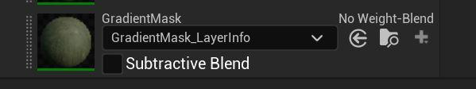

This layer is intended to be used with the UML System’s Blueprint Prefab Mountains which will be discussed later in the document.

Since this is actually a regular layer weight paint file, you can select this layer and use a textured brush to paint into it. The curve will read the black and white value between 0-1 and get the color data on the curve asset matching the 0-1 position.

Usage

First you need to create a new Color Curve Gradient asset. Right click in the Content browser and search for “Curve”, then select CurveLinearColor from the 3 options.

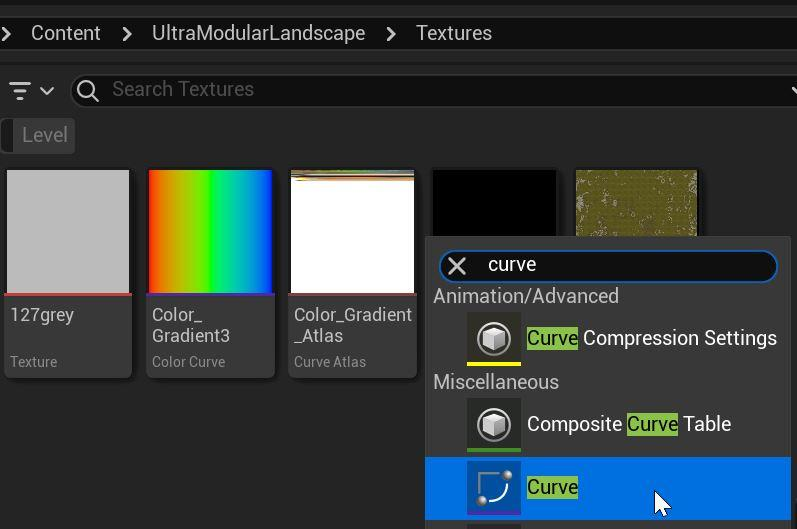

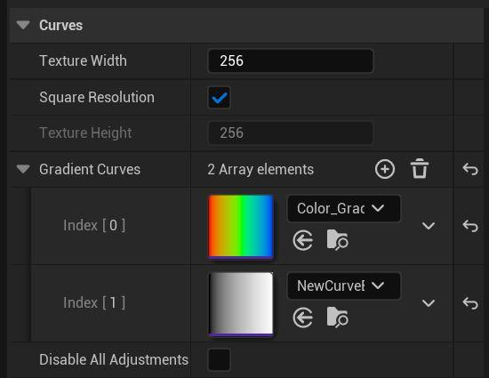

Open the Curve Atlas called CA_Color_Gradient_Atlas, then hit the plus sign next to the Gradient Curves section. Then load your new curve asset into the new index. Make sure to hit save.

Now you can load your new curve asset into the material instance and once you open it up, you can add new color values with the top handlers. These colors will act as tinting on your base color texture. You can also use the bottom handlers, which set the opacity level on the curve. UML’s material reads these as the desaturation value for your base color.

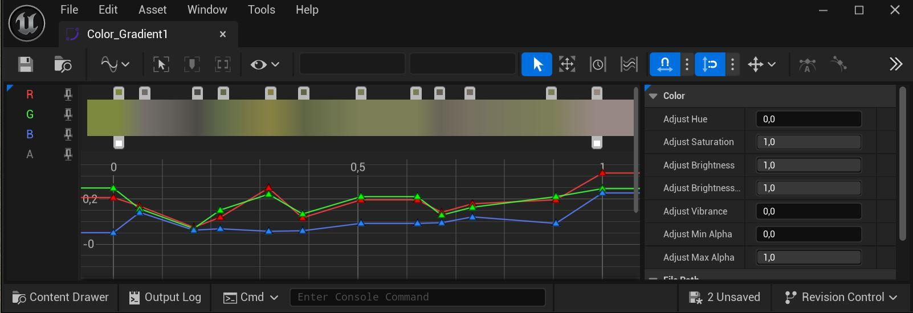

Notes:

- If you assign a new curve asset into the Gradient Color - Color Curve Gradient parameter and the material is not updated, disable and then enable this parameter again. This is due to an editor bug.
- If you are using your own layer instance file assigned into the Layer Asset slot instead of the default ML_UML_Layer file, then the previously mentioned curve parameter won’t have a proper slot for the curve asset. Instead it will show a number, which is the index number of each Curve asset available. You can find the right index, by opening the atlas asset (CA_Color_Gradient_Atlas), then opening the Gradient Curves array. It’s advisable to name the curves so that they have their index number in them.
   This is unfortunately an engine bug, so there is nothing we can do to fix it, other than wait for Epic.

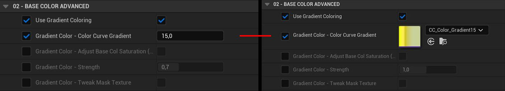

*The same gradient with index 15 is used on both sides of the image.*

*Fuzzy Shading (No RVT)*

This feature emulates fuzzy surfaces like dense grass or moss, where looking vertically down, the viewer can see the darker bottom parts, while looking at a grazing angle see the brighter top part.

This version doesn’t support RVT, so in case you have that enabled, make sure to use the RVT compatible version in the Global settings, found on the Details panel of the material instance.

*Macro Overlay*

This overlays a large tiling pattern over the Base color. As default it expects a black and white image, if you intend to use a colored noise texture, you can enable it with the following switch param.

- *Macro Overlay - Color texture (or Grayscale)* – Colorize the original texture
- *Macro Overlay - Distance* – Sets the minimum view distance, normally we want the macro texture to be visible only in the distance. Set this to 0 if you want it to be always visible.

*Overlay AO*

This artificially overlays the AO texture on top of the Base Color. Good for cases when direct light removes the AO effect and you might want to artificially bring it back.

#### 02 – ROUGHNESS / SPECULAR / AO

*Specular Mask Min & Max*

Uses the AO texture to reduce the specularity (reflectivity) of the surface. Real natural surfaces have lots of cavities that trap lightrays and prevent reflection. We can emulate this behavior with

Reduce Specular Far Away

Reduces the Specular contribution even more in the distance.

The distance where it takes effect is controlled by the *Distant Texture – Fade in distance* parameter, which is found in the *00 – Tiling section*.

- *Specular Mask Distant* – Controls the reduction strength, by multiplying the base Specular.
- *Distant Texture - Fade in distance* (located in the *00 – Tiling* section) – Controls the distance where it takes effect. Note: this is shared with the Distant texture LOD.

Use Custom Channel Packing (or ORDp)

If this is disabled the layer expects a channel packed ORDp texture, containing the Occlusion + Roughness + Displacement data. If this is enabled, you can use separate textures for these. Make sure to select the appropriate color channel where the data is.

#### 03 – DISPLACEMENT / NORMAL / CONTACT SHADOW

*Normal - Separate Distant Strength* – If the Distant texture LOD is enabled, its normal strength can be controlled with this separately.

**Contact Shadows**

When it comes to contact shadows, normally only meshes are considered, but UML has a unique feature that allows Unreal to consider the material details (using the height texture) as well when calculating contact shadows. First, this effect needs to be enabled globally for the whole material in the Details Panel and of course you will also need to enable the regular contact shadow feature on your directional light.

- *Details Panel > Use Contact Shadows* – Enable the effect for the whole material
- *Details Panel > Contact Shadows Length* – The scale/size of the shadows

There are further separate controls for each layer.

- *Contact Shadow Local Contrast* – Extra strength boost only for this layer
- *Contact Shadow Local Offset* – Offsetting the height texture value of this layer, to better match the surrounding other layers’ height values. This way we can avoid unnatural shadowing where different layers are blended.

**Displacement**

This section is only used ONLY when you enable Nanite displacement on the Landscape. Select the Landscape and look for the „Enable Nanite” parameter, then hit the Build Data button.

If you are using old Megascans textures, it is best to switch the Displacement texture (or ORDp) to use HDR compression setting, otherwise the height data is too noisy.

- *Displacement Contrast Close* – Controls the strength of the displacement. -0.5 value gives zero.
- *Displacement Offset Close* – Raises or lowers the whole layer compared to the other layers. Doesn’t affect the intensity of the details.
- *Close & Far* – If you have the Distant texture LOD enabled, both parameters will have a Close & Far variant to control the LOD separately.

If you experience noisy displacement, make sure that you set the right compression settings for your texture. Single height/displacement textures should use the Grayscale option. If you are using an ORDp texture (old Megascans assets), it’s best to set it to HDR mode. (Beware of the higher memory footprint.)

#### GLOBAL PARAMETERS

There are parameters in the Details panel of the material instance, these are affecting the whole material and every layer. Some features had to be placed after the layers are composited together, for example because they are view or distance dependent, which means they have to bypass the Runtime Virtual Texture (RVT) read/write section.

**Contact Shadows**

This feature makes it possible for the surface details to cast contact shadows based on the height map. For it to work, you need a light source to cast contact shadows (for example the directional light). Also this feature is targeted for low to medium quality platforms, for high end platforms a better quality alternative is using Nanite displacement, which produce actual geometry that cast real shadows.

**Fuzzy Shading (RVT compatible)**

This works similarly to the per layer variant, but is also compatible with RVT because it is applied after the RVT texture writing phase, therefore allowing a view dependent material reaction. It is possible to apply the effect selectively to specified layers, but be aware that in this case the feature reads the raw layer weight painting data. Which means it doesn’t have access to the height mixing and other blending tweaks done on each layer.

IMPORTANT: make sure to have every layer sample that is used in the material instance connected to the Fuzzy Shading material function found in the master material.

**Global Overlay**

With this feature you can overlay color texture and normal map on your landscape. It supports tiling textures that can be used for extra macro or micro details. But the main use-case is that if you use your own custom landscape terrain that is generated in an external software (like World Machine), these software can create a unique color texture and detail normal texture for the whole landscape. This is where you can plug those in and overlay on top of the whole landscape. The overlay strength can be controlled separately for each material layer.

- *Use Global Overlay Color* – Enable overlaying the color texture
- *Use Global Overlay Normal* – Enable overlaying the normal texture
- *Global Overlay - Distance Fade* – Enable if you want the overlay to be visible only in the distance layers.
- *Global Overlay - Map to Landscape Exactly* – Use this if you generated the texture in a software and want to map to the landscape. Set the Scale param to match the Landscape’s resolution
- *Global Overlay - Triplanar Projection (or top down)* – Enable this if you want to use tiling textures and prevent stretching on steep angles.
- *Global Overlay - Color* – There are multiple parameters to tweak the color texture (contrast, lightness, opacity). Also two blending mode, burn (which multiplies the base color with the overlay color values) and regular linear blend (using the opacity value).
- *Global Overlay - Normal Overwrite Original* – With this enabled the overlay normal will overwrite and replace the base normal completely. If this is off, the material is blending the two together.

**Use Runtime Virtual Textures**

Enable this if you plan to use RVT. Setting up Unreal to work with RVT requires a few steps, it’s best to read the official documentation of how this works in the editor, but here is a brief overview.

- Make sure that the feature is enabled in your Unreal project. *Project Settings > Enable virtual texture support*
- Select your landscape, find the virtual textures array, click the plus button to create new entries and then plug in the textures you intend to use. Then hit the Create Volumes button.

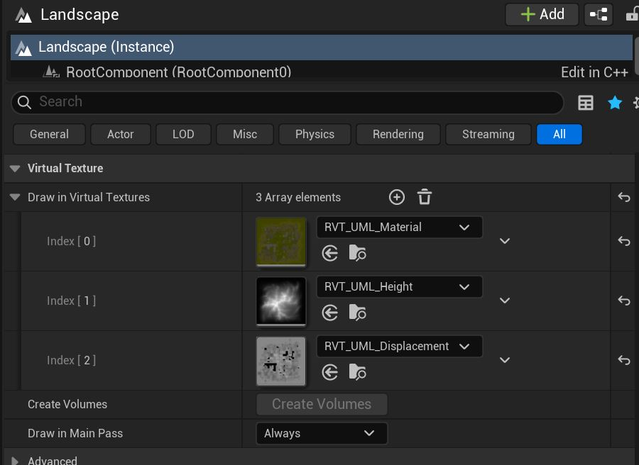

- Make sure that the same textures are applied in your material instance, in case you are using your own, custom ones.
- If you have created the RVT Volumes by hand, make sure that their size match the landscape.

Material / Height / Displacement RVT texture

- *RVT_UML_Material* – This is the whole material (Base color, Normal, Roughness, Specular)
- *RVT_UML_Height* – This is the absolute vertical position of each pixel and only required if you are using RVT to blend other meshes or actors with the landscape texture.
- *RVT_UML_Displacement* – This is the displacement texture, required only if you are using Nanite Displacement or UML’s Contact Shadow feature.
- You can use your own RVT textures, just make sure to assign to the Material Instance (Details Panel > RVT Textures)

**Landscape Grass**

As of 5.6 PCG is still not supporting GPU based instance spawning, every instance related calculation runs on the CPU, which means spawning instances real-time can be very costly with high instance count.

This means for real-time spawning of instance number above 100k, landscape grass is still the only viable option, despite its shortcomings.

The main drawback of landscape grass is that it can’t be customized with material instances, it can only be set up in the master material. This is why UML’s Alpine example level uses a duplicate master material.

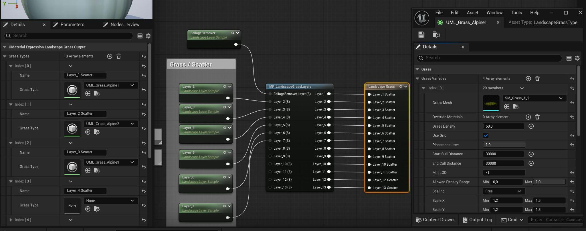

- Open *M_UML_Master*, plug every Landscape Layer Sample that is used in the material into the MF_LandscapeGrassLayers node.
- Click on the Landscape Grass node (selected on the image) and assign your Grass Type assets to the layers that you intend to spawn foliage on.
- Make sure that your Grass Type files are set up properly (you can use UML_Grass_Alpine1 as reference)
- After doing any major changes, make sure to recompile the master material, then erase and reapply your material instance onto the Landscape. This should force the grassmaps to get updated. If this doesn’t happen, then in Unreal click Build > Build Landscape.

**Grass Maps parameters in the material instance**

*Spawn Grass on Layer_1* – Unreal treats Layer_1 as the “Background”, which is always visible. Because of this, the actual Landscape Layer’s paint value might not change at all. With this parameter, you can control if you want grass on Layer_1 or not.

*Remove AutoCliff layer from Grass map* – Remove the grass from areas covered by the Auto_Cliff blending option. Keep in mind that this is using the unprocessed angle mask of this feature and has no access to the final blend of the height mix option.

*Tweak Layer Strength Separately* – With these parameters you can separately tweak each layer’s weight paint (strength and contrast). Useful if the grass is overgrown or missing from a layer. This might happen because the grass map is calculated from the raw, unprocessed Landscape layer paint, but the final visible layer is also processed with the height mixing option. The latter is not accessible for the grass map system.

### Blend Asset & Layer Blending Features

As showcased in the setup section, each landscape layer in the material instance has its own Blend Asset assigned, which is an instance of UML’s Master Layer Blend Function. Opening down this submenu allows you to tweak each layer’s blending separately from the other layers.

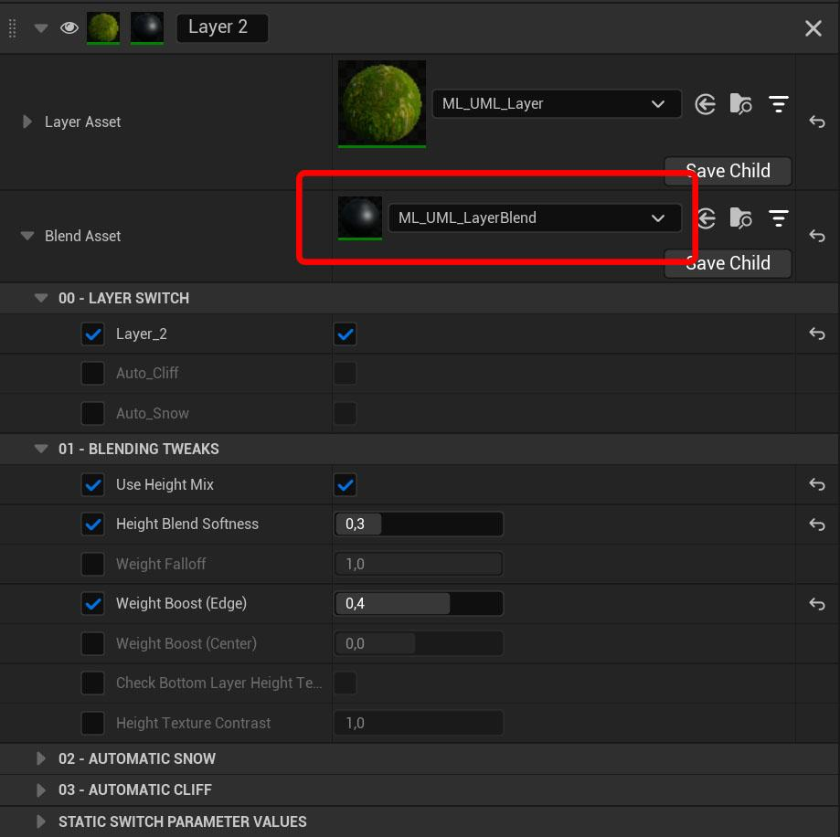

**00 – LAYER SWITCH**

This is a mandatory section, you need to pair the material layer to one of the Landscape paint layers. UML supports 13 different layers out of box, Layer 1 is the default layer called “Background” (this name is hardcoded by Epic and can’t be changed). If you want to switch the layer to another layer, uncheck the existing option first, so that all the available options appear.

UML also supports two auto-material features: automatic cliff (can be any type of material, it only refers to steep angled areas) and automatic snow peaks.

**01 – BLENDING TWEAKS**

Height Mix

Height mixing is essentially using the current layer’s height/displacement texture to control which of its parts should appear first. For example higher parts (like rocks and other peaks) will appear first, while holes will appear last. It’s perfect to break up low resolution masks (like the landscape paint layers or the automatic snow and cliff generators) and make the blending more detailed.

- *Height Blend Softness* – 0 is completely sharp, 1 is fully soft transition between this and the bottom layers. Basically making the final blend sharp or soft.
- *Height Texture Contrast* – The height texture’s intensity, basically the distance between the texture’s low point and high point.
- *Weight Falloff* – Determine how soft or sharp the weight map (the landscape layer paint) should be. 1 is default, 0 is processed to be ultra sharp.
- *Weight Boost (Edge)* – Increasing the weight map’s (the landscape layer paint) intensity, favoring the outer edges (the weaker/darker areas).
- *Weight Boost (Center)* – Same as above, but favoring the already stronger/whiter areas.
- *Check Bottom Layer Height Texture* – This will analyze the height texture data under this layer and consider it when processing the blending.

**02 – AUTOMATIC SNOW**

Enable the *Auto_Snow* option in the *00 - Layer Switch section*.

Automatically create snow peaks.

- *Snow Line* – The start height of the snow (World position Z axis value).
- *Snow Line Falloff* – The harshness of the mask’s gradient. (Make sure to check height mixing and other blending tweaks.)
- *Snow Vertical Strength* – If snow should exist only on the top of the surface or on the side too.
- *Snow Vertical Falloff* – How sharply should the snow be removed from the side surfaces.

**03 – AUTOMATIC CLIFF**

Enable the *Auto_Cliff* option in the *00 - Layer Switch section*.

Automatically paint this layer to any surface area that has a sufficiently steep slope.

Its strength, contrast and steepness can be tweaked.

*Automatic Cliff - Limit using Paint Layer*

Normally the Auto Cliff feature paints the layer everywhere that has a matching angle (determined by the strength and contrast params). With this option you can use a Landscape Paint Layer to determine where not to paint the cliff layer.

IMPORTANT: after enabling this parameter, go back to the 00 - Layer Switch section and select which paint layer should be the one the Auto Cliff feature checks. You can paint this layer by hand or rely on UML’s Blueprint Prefab mountains to write the selected landscape layer.

### Usability Tips

Hiding/disabling layer (with the eye icon) is broken in 5.6. Make sure to reload the material to force refresh this.

Some bigger material changes (usually the ones that require material recompilation via enabling/disabling the feature on a layer or on the material instance) might not show up visually. If you are not seeing the change, you can force the editor to update it by clearing the Landscape’s material slot and then reassigning your material to it.

### Known Bugs

- Part of the landscape disappears after building Nanite landscape in 5.6
   - Due to an engine code bug, Nanite is only built for the first 64 components of the landscape only. A temporary workaround is to use multiple landscapes with 64 or less components each or enable world partition.
   - A proper fix is expected to arrive in 5.7 from Epic
- Landscape Grass not appearing
   - The Landscape Grass Output node in the master material needs to be filled up with Grass Type assets up to the last layer that is requiring grass on it.
   - For example if you want grass on Layer_1 and Layer_4, you need to put an empty Grass Type asset into Layer_2 and Layer_3 as well.
- Reorder of the layers in the material instance’s Layer Parameters tab doesn’t work
   - Due to an engine bug the editor doesn’t detect properly the reordering of the layers if the layer asset is the same file for both layers.
   - For example if both layers use the base ML_UML_Layer, then only their names are reordered, all the parameters stay unchanged.
   - Workaround: use different files in the Layer Asset slot. Click the Save Child button to create a new instance copy of your parameters, then load this instance into the Layer Asset slot.
- Doing major changes to the material doesn’t show up
   - For example: changing Layer Asset file, changing the landscape grass asset in the master material, etc.
   - Due to an engine bug the editor doesn’t detect some changes. To force full recalculation of the landscape material, you can reload the level or remove and then reapply the landscape material to the landscape actor.
- When using Gradient Coloring with a material layer instance, its slot shows a number instead of the Color Curve Gradient file. This is an engine bug, the number is the ID of the gradient curve in the Color Gradient Atlas file.
   - For easier working with the bug, it’s advised to name the Color Gradient file so that it has its ID in the name.
- Material based Contact Shadows not working
   - Due to an engine bug in 5.7, if there is a Runtime Virtual Texture output in the material, then the engine ignores the Pixel Depth Offset output.
   - Delete the RVT output node in the M_UML_Master material and recompile, UML's contact shadows will appear as expected. Unfortunately there is no way to use both RVT and material based contact shadows in 5.7 until Epic fixes this engine issue.

## 2 - Blueprint Prefab Mountains

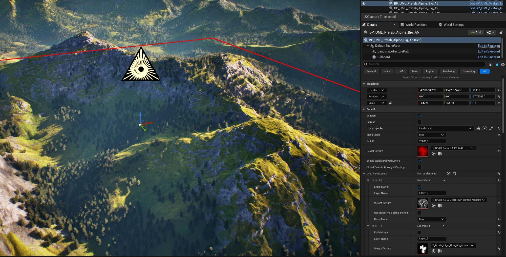

The Blueprint Prefab Mountain system allows you to spawn complete mountains, affecting multiple landscape material layers, each using erosion masks. These mountains are integrated into your traditional Unreal landscape system, which means they can be combined and modified by hand in a non-destructive workflow. It supports the Landscape mode's edit layers, you can fine-tune them by sculpting and painting on the layers. The best part is that it doesn't consume any extra resources.

**PLUGIN REQUIREMENT**

The Landscape Patch plugin is required for the Prefab Mountains.

### Setup

#### Spawning Your First Prefab

To get started just drag and drop a Blueprint Prefab Mountain from the Content Browser onto your landscape. You can either use the empty base Blueprint (*BP_UML_Prefab*) or any of the preset instances in UML_Prefabs/Prefabs/Alpine and UML_Prefabs/Prefabs/Iceland.

When you first drop a Prefab on your landscape, Unreal automatically asks permission to create a *Patches* layer in the Landscape Sculpt tab’s Edit Layer stack.

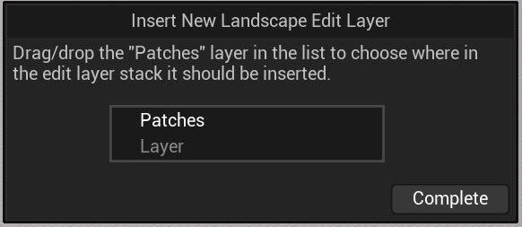

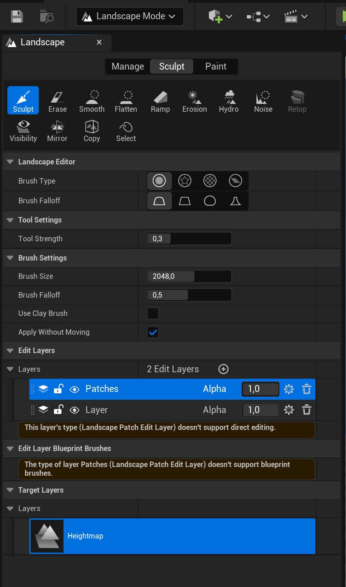

All the height and color data that a Prefab creates is contained in this layer. Usually you will use only one Patch layer to host all your Prefabs, but if you want to increase modularity, you can create further Patch layers by clicking the plus sign above them. In this case you need to manually switch the selected Prefabs to use this layer. You can do this by selecting the Blueprint Prefab actor, then selecting their LandscapeTexturePatch component, then scrolling to Settings > Edit Layer.

#### Setting Up Material Layers

If you want to use the Prefabs only to sculpt your Landscape, then you don’t need to set up material layers.

But the real power of this system comes from the ability to create, move and combine complete mountains including all the different material/paint layers, driven by erosion masks.

The system works with any Landscape material as long as it uses the same layer naming convention (Layer_1, Layer_2, … etc), but for best compatibility use it with the Ultra Modular Landscape Material.

First, assign your material to your landscape.

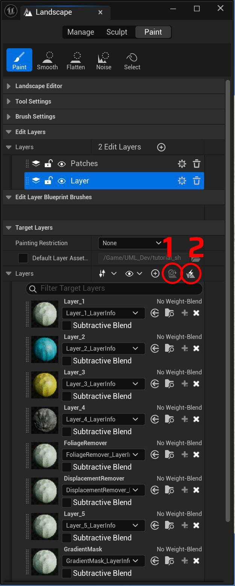

Then switch to Landscape Mode and to the Paint tab. In the Layers section press the 1st icon circled (called *All Material Layers Created*). This will create a paint layer for all the layer samplers existing in the material that you assigned to your landscape.

After this you need to create and assign Layer Info files to each layer. This can be done in two ways, you can either click the plus sign next to each layer and create these one-by-one manually.

Or press the 2nd icon circled (called *Auto-Fill Target Layer Assets*), make sure to enable the option called *“Create new assets in the default folder if none are found*”*.*

Make sure to set the Layer Info files to be *No Weight-Blend*. It is possible to use weight blended layers, but some fringing might happen this way. You can always switch the type of any Layer Info file. Just open the file and enable/disable the checkbox.

#### Modify by hand using Edit Layers

You can modify the results of the Prefab Mountains in a non-destructive way by painting and sculpting by hand. For this, create a new Edit layer above the Patches. If you want to apply the modifications only to certain Prefab Mountains, you can create another Patches layer above this newly created regular Edit Layer and assign the selected Prefab Mountains to this new Patches layer. (Select the Prefab actor, components > LandscapeTexturePatch component > Settings > Edit Layer.)

### Working with the Prefabs

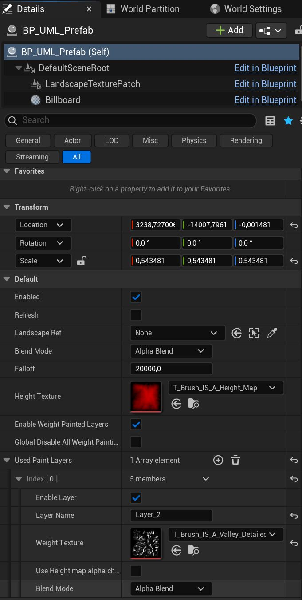

#### Using Erosion Maps

To make the Prefab Mountain affect the Landscape material’s layers (Paint Layers) assign the erosion maps in the *Used Paint Layers* array.

Click the plus icon to create a new empty array element, set the name to match the layer you want it to target (Layer_2, Layer_3, etc.), then select a mask texture that will set the landscape paint weight of this layer under this Prefab.

#### Blending Multiple Prefabs

Blending different Prefab actors is based on two things: Draw order (Priority) and the Blending mode.

Prefab actors with a higher Draw order (Priority) number will be drawn on top of others. You can change this value by selecting the LandscapeTexturePatch component and changing the *Priority* variable.

Blending can be changed independently for the Height Texture and every Paint Layer Weight Texture.

#### Working with multiple Landscapes

When creating a new Prefab Mountain from scratch, it automatically gets assigned to the first created Landscape. If you have only 1 landscape, then you don’t need to do anything further.

If you have multiple landscapes, you can assign the appropriate landscape by setting the Landscape Ref variable. Also if you copy a Prefab from another level or for any reason it loses the connection to the landscape, this is the variable that helps you reconnect it. Keep in mind that you can select multiple Prefab Mountains and edit their Landscape Ref variable at the same time.

#### Usability Tips

If you want a lag free, real-time editing experience, it is best to keep a single landscape under 4km by 4km and under 256/128 total components.

Epic changed how the Landscape Patch plugin works after 5.5 and 5.6. Previously when first spawning a Prefab Unreal also created a Patch Manager that was linked to a single landscape. You could duplicate this manager and link it to a secondary landscape. In that case the Prefabs affecting the new landscape had to be linked to the new Patch Manager.

If you want to quickly bake down a Prefab actor to standard height sculpt data you can do with the following:

- Create a new sculpt edit layer above the Patches layer (where the Prefabs put their height data)
- Select the flatten mode in the sculpting tab, set flatten target to 0 (or wherever the base of the mountain is) and flatten out the landscape so that the mountain disappears
- Now if you hide the Patches layer, you should see the mountain’s exact copy, but inverted
- Make the new sculpt edit layer’s alpha value to -1 instead of 1. This will invert its contribution.

## 3 - EasyPCG

EaysPCG is an easy to use, fully customizable and versatile Blueprint, with a robust Procedural Content Generation (PCG) graph under its hood.

**PLUGIN REQUIREMENT**

The *Procedural Content Generation Framework (PCG)* plugin is required for EasyPCG.

### Getting Started

After placing a new EasyPCG actor, the first thing to do is to link the Landscape actor that is targeted via the *Landscape Ref* parameter.

#### Setting the Meshes

There are two ways to configure what meshes EasyPCG should use:

- Set a single static mesh by assigning it to the *Custom Mesh* parameter
- Set multiple static meshes in a Data Asset (DA) file
   - Enable the *Use Meshes Data Asset* parameter
   - Assign your own DA into the *Meshes Data Asset* parameter

#### Working with Data Assets

To create your own Data Asset, you can duplicate UML’s preset DAs or create one from scratch using the following steps:

- Right click in the Content Browser and go to Miscellaneous > Data Asset (choose the one with the spherical pie chart icon)
- In the pop-up window you can pick a class, make sure to choose: *PDA_Meshes_PCG_UML*
- Open your new DA file and click the plus sign next to the Meshes array to create a new entry

Changing anything on the Data Asset file will **NOT** initiate the PCG actor to recalculate its current state. To actually see the changes in the level, select the EasyPCG actor that uses it and hit Refresh.

The Data Asset has various settings for every assigned mesh, these can be tweaked individually:

- *Spawn Probability* – This number marks the spawn probability compared to the other meshes currently assigned in this DA. Can be any arbitrary positive number, it can also be 0 or go over 1.
- *Scale* – Scale of this mesh. Supports non-uniform scaling.
- *Scale Random Multiply* – Marks the min/max offset. Putting it to 2 will make the biggest instance 2x and the smallest 1/2x. All the instances are spread in between min and max.

#### Spawning Instances

There are 3 key factors that determine how instances are spawned:

- Random Placement vs Texture Based Placement
- Full Cover vs Limiting to Selected Landscape Layers
- Single Instance Placement vs Procedural Cluster Generation

These settings will be discussed in depth in the following sections.

### Layer Mode

The Layer Mode determines how to spawn the instances (random vs texture based) and how the instances are filtered by the Landscape Paint Layers (full cover vs selected landscape layers).

#### Spawning Only On Selected Landscape Layers

This feature works with any landscape material that follows the required layer naming convention (Layer_1, Layer_2, etc.).

To activate it, switch the Layer mode to either of these options:

- *2 - Select Multiple Layers to Spawn On* – To spawn randomly scattered
- *4 - Texture Based / Selected Layer*s – To spawn based on a mask texture

#### Layer Mode 2 - Choose Layers To Spawn On

After selecting mode 2 or 4, scroll down to the *Layer Mode 2 - Choose Layers To Spawn On* section, here you can select which layers should be considered.

*Manual Set Layers To Affect* – EasyPCG automatically detects the used Landscape Layers. If you want to exclude certain ones from its calculation, you can enable this option. After this, you will be able to manually add, remove or rename layers in the *Layers to Affect* array parameter.

#### Layer Mode 2 - Tweak Layer Weights

After selecting mode 2 or 4, with these parameters you can individually tweak every layer weight’s strength and contrast.

**Why to use?**

The material might use height blending to improve the details of the blending between layers, but the PCG component doesn’t have access to the final blend. Since it can only access the raw Landscape layer weights, using EasyPCG’s tweaks are especially helpful when the foliage it spawns is misaligned and differs too much from the final visible material layers.

#### Layer Mode 3 & 4 - Texture Based

When using Layer mode 3 or 4: instead of spawning instances randomly scattered, spawning follows a texture mask.

Parameters to consider with this mode:

- *Mask Texture* – This is the texture mask that is used, you can use any type of texture. (Mip management is unstable with PCG, if you need the mask to be high resolution and high precision make sure to disable mip maps for the texture.)
- *Mask Scale* – Tiling of the mask texture
- *Spawn Probability (By Layer Strength)* – The likelihood of spawning an instance where the mask texture is darker.
- *Scale By Mask Weight* – Make the instance smaller where the mask texture is darker.

### Basic Settings

- *Spawn Density* – Use this to control the amount of instances spawned
- *Global Mesh Scale* – Change the final scale of the meshes. If you are using the Meshes Data Asset option and set scaling for different meshes, the two scale will be multiplied together.
- *Global Mesh Scale Random Range* – Value 1 means there is no random scale variation. A value of 2 would mean that the biggest instance is 2x bigger, the smallest is 2x smaller. All of the instances are getting a random scale between the two end-points.
- *Random Seed* – EasyPCG can be used both with a deterministic and with a random approach. Multiple EasyPCG actors having the same Random Seed number will spawn the same points in space, you can use this to combine different meshes to create various effects. (See the Example_Level for a demonstration.)
   On the other hand, if you want completely new and random results, you can change the Random Seed number to be different.

### Instance Tweaking

- *Limit Surface Angle* – Use this if you want to avoid spawning on steep surface angles
- *Max Limited Surface Angle* – If *Limit Surface Angle* is enabled, this controls the maximum surface angle in degrees that we spawn instances on.
- *Align To Surface* – Enable this, if you want the spawned instances to point away from the surface. (For example trees following the surface’s up vector)
- *Random Pitch Angle* – Adds random pitch rotation in a range to both X and Y axis. For example setting this to 5 means that the added maximum rotation will be 5 or -5 degree, the instances will receive a value between the two end-points. Set this to 180 for a completely random 360 rotation.
- *Scale by Mask Weight* – Making the instance smaller at the “edges” (where it is darker or black) of the landscape weight painting and the mask texture if it is used. Ideal to mimicking how plants grow in clusters, smaller at the edges.
- *Scale by Mask Weight - Vertical Boost* – Same as the previous parameter, but affecting only the Z axis of the instances.
- *Offset Instances* – Offset the instances’ position in local space
- *Modify Height* – Stretching the instances, basically scaling only on their Z axis. Good for tweaking grass height.
- *Instance Culling Distance* – Sets the distance where the spawned instances will be culled. 0 means infinite (culling disabled).

### Placement

#### Procedural Cluster Generation

EasyPCG can spawn instances in two ways:

- Single Instance Mode (default) - With this every calculated PCG point is used to spawn a mesh instance
- Procedural Cluster Mode - With this the calculated PCG points are NOT used to spawn mesh instances, instead they act as seed for spawning a whole cluster of new points around them.

This spawn method allows us to imitate different natural phenomena, for example realistic plant growth, but rocks also often behave like this. In both cases, there are bigger pieces in the center and smaller ones at the edge of each cluster.

Parameters to consider:

- *Use Procedural Cluster* – Enable the Procedural Cluster Generation effect
- *Cluster Amount* – Control the number of clusters
- *Cluster Size* – Control the size of a cluster
- *Scale By Mask Weight* – Control how much instances should be smaller at the edge of each cluster.
- *Scale By Mask Weight - Vertical Boost* – Same as the previous, but only affecting the vertical scale of each instance.
- *Spawn Density* – This controls the number of final instances in a cluster.

#### Avoiding Manually Placed Objects

EasyPCG can detect manually placed objects and avoid placing PCG instances that would overlap these.

To use this feature, enable *Avoid Regular Meshes* parameter and place down a detector Blueprint actor overlapping the targeted meshes.

Technical things to know when using this feature:

- Object detection is handled by a **separate Blueprint actor**, called *BP_Foliage_ObjectDetection.* This must overlap all the objects that you want EasyPCG to calculate with.
- The overlap is calculated with the **object bounds** and NOT the actual polygons, which means large scale, hollow meshes can be picked up. For example if the skysphere is a big static mesh, the system will detect that an object is filling up the whole space and remove every spawned instance..
- The detector only detects Blocking Volume and Static Mesh object types, which means you can convert any objects you want to exclude from detection into an empty Blueprint actor (for example to avoid detecting the skybox - see on the Example_Level)
- On the other hand, if you want to detect Blueprint actors, the only workaround is to manually attach a simple Static Mesh to them.
- Since detection works with the object bounds, it doesn’t matter if the actor is rendered or not. You can make it Hidden in Game or disable the Visible option.
- The detector actors and the EasyPCG actors are communicating with each other in a flexible way.
   - The detector BP will communicate all the detected meshes to every EasyPCG actor that it touches/overlaps.
   - The detector BP doesn’t need to encompass the entirety of an EasyPCG actor, it can be placed and scaled to overlap only the meshes you want to detect.
   - You can place multiple smaller detector Blueprints.

#### Further Placement Parameters

- *Enable Distance Check (Avoid Overlapping)* – If you want high density with meshes that should not overlap, you can check the minimum distance between different instances.
- *Minimum Distance Between Instances* – Sets the minimum distance value if *Enable Distance Check* is enabled.
- *Spawn Probability (By Layer Strength)* – Similar to the *Scale by Mask Weight* param, spawning will be less likely to happen where the landscape weight paint or the texture mask is darker. This is ideal to imitate real cluster growth, where the cluster edge has gradually less plants.
- *Use Edge Feathering* – Instances are spawned only within the bounds of the EasyPCG volume. Because of this, having high density of instances results in a visibly sharp border, where the instances suddenly stop spawning. With this feature the instance spawn density is gradually lowered close to the edge of the volume.
- *Edge Feathering Amount* – Set the intensity of the gradient that is used to lower the instance density close to the volume edge. The *Use Edge Feathering* must be enabled for this feature to work.
- *Edge Feathering Vertical Amount* – Similar to the previous, but calculating only with the top and bottom edge.
